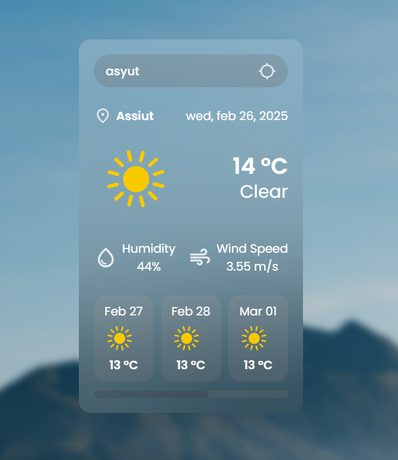

# Weather App

A responsive and elegant weather application that provides current weather and a 5-day forecast for any city worldwide.

## 📋 Features

- **Real-time Weather Data**: Get up-to-date weather information for any city
- **Weather Forecast**: View a 5-day weather forecast
- **Dynamic UI**: Responsive design that works on mobile and desktop
- **Weather Conditions**: Display temperature, humidity, wind speed and weather conditions
- **Visual Weather Indicators**: Weather icons change based on conditions

## 🚀 Technologies Used

- HTML5
- CSS3 (with modern styling techniques)
- JavaScript (ES6+)
- OpenWeatherMap API
- Google Fonts

## 🖼️ Screenshots



## 🛠️ Setup and Installation

1. Clone the repository:
   ```
   git clone https://github.com/yourusername/weather-app.git
   ```

2. Navigate to the project directory:
   ```
   cd weather-app
   ```

3. Open `index.html` in your browser, or set up a local server.

4. For API functionality, use your own OpenWeatherMap API key:
   - Sign up at [OpenWeatherMap](https://openweathermap.org/api)
   - Replace the API key in `main.js`:
     ```javascript
     const apiKey = "YOUR_API_KEY_HERE";
     ```

## 💻 Usage

1. Enter a city name in the search box
2. Press Enter or click the search button
3. View the current weather and forecast

## 📁 Project Structure

```
/
├── index.html               # Main HTML file
├── assets/
│   ├── src/
│   │   └── styles.css       # Main CSS file
│   ├── scripts/
│   │   └── main.js          # Main JavaScript file
│   ├── message/             # Message related images
│   │   ├── search-city.png
│   │   └── not-found.png
│   ├── weather/             # Weather icons
│   │   ├── clear.svg
│   │   ├── clouds.svg
│   │   ├── rain.svg
│   │   ├── snow.svg
│   │   └── ...
│   └── screenshots/         # App screenshots
└── README.md
```

## 🔄 API Endpoints Used

- Current Weather: `https://api.openweathermap.org/data/2.5/weather`
- Weather Forecast: `https://api.openweathermap.org/data/2.5/forecast`

